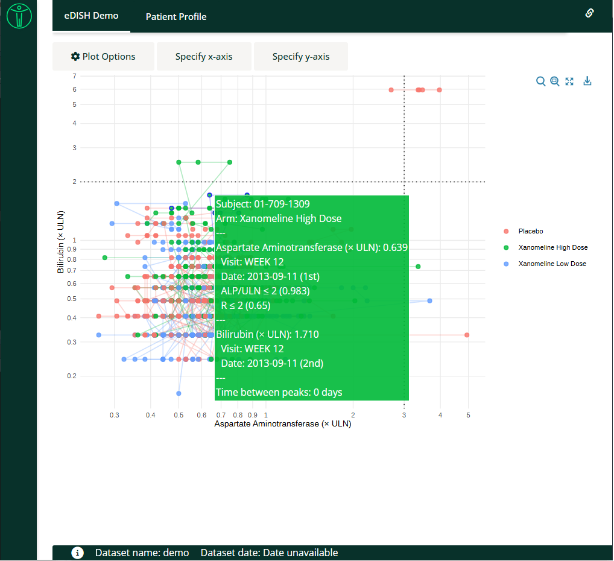

# eDISH Module

The eDISH module supports the assessment of drug-induced liver injury by means of the (modified)
evaluation of Drug-Induced Serious Hepatotoxicity plot.



## Installation

``` r
if (!require("remotes")) install.packages("remotes")
remotes::install_github("Boehringer-Ingelheim/dv.edish")
```

## Features

The eDISH module shows a scatter plot depicting the correlation between peak values of an
aminotransferase parameter and a liver function parameter on a subject level.

Beneath the scatter plot, a table of subject counts and percentages in areas delimited by the
specified reference lines can optionally be displayed.

The user can control the following from the drop-down "Plot Options" menu:

- Whether the parameters are displayed in multiples of either their upper limits of normal
  (resulting in the eDISH plot) or the corresponding subject's baseline values (resulting in the mDISH plot).
- Treatment arm selection.
- Whether the table of subject counts and percentages is displayed.

The user can control the following from the drop-down "Specify x-axis" menu:

- The aminotransferase parameter to be displayed on the x-axis (e.g. Alanine Aminotransferase or
  Aspartate Aminotransferase).
- Vertical reference line indicating a ULN/baseline multiple or other threshold.
- Lower and/or upper values of the x-axis range. If not specified then these values are determined by the data.
- Whether to plot the absolute value of the parameter on the x-axis rather than a multiple of ULN/baseline.
- Whether to plot subject aminotransferase values by visit, with lines connecting points between visits.
- Whether to include subjects based on their baseline value being within the aminotransferase threshold.
- Whether to include subjects based on their baseline aminotransferase value being less than/less than
  equal to/more than/more than equal to a ULN multiple threshold.

The user can control the following from the drop-down "Specify y-axis" menu:

- The liver function parameter to be displayed on the y-axis (e.g. Total Bilirubin or
  Prothrombin Intl. Normalized Ratio)
- Horizontal reference line indicating a ULN/baseline multiple or other threshold.
- Lower and/or upper values of the y-axis range. If not specified then these values are determined by the data.
- Whether to plot the absolute value of the parameter on the y-axis rather than a multiple of ULN/baseline.
- The window in which the liver function parameter value is considered in relation to the aminotransferase value.

When hovering over a point the following pop-up information is displayed:

- Subject identifier.
- Arm.
- Normalized (or absolute if selected) aminotransferase peak value, visit, and date.
- Associated normalized Alkaline Phosphatase value categorized.
- R-ratio categorized.
- Normalized (or absolute if selected) liver function parameter peak value, visit, and date.
- Time in days between aminotransferase and liver function dates. Negative days indicates that liver function date
  is before aminotransferase date.

Normalized Alkaline Phosphatase (ALP/ULN or ALP/Baseline) categories are shown as ≤ 2 or > 2.

The R-ratio (specific to ULN) is calculated as `R = Normalized aminotransferase / Normalized ALP`:

- R ≥ 5 Hepatocellular - aminotransferase dominates; typical for Hy's Law
- R ≤ 2 Cholestatic - ALP dominates
- 2 < R < 5 Mixed - Both aminotransferase and ALP elevated

## Creating an eDISH application

The following example shows how to set up a simple DaVinci app by means of {dv.manager}. 
The app contains the eDISH module to display dummy data provided by the {pharmaverseadam} package: 

``` r
dm <- pharmaverseadam::adsl
lb <- pharmaverseadam::adlb
  
module_list <- list(
  "edish" = dv.edish::mod_edish(
    module_id = "edish",
    subject_level_dataset_name = "dm",
    lab_dataset_name = "lb",
    lb_date_var = "ADT",
    arm_default_vals = c("Xanomeline Low Dose", "Xanomeline High Dose"),
    baseline_visit_val = "SCREENING 1"
  )
)

dv.manager::run_app(
  data = list("demo" = list("dm" = dm, "lb" = lb)),
  module_list = module_list,
  filter_data = "dm"
)
```

Note that the module expects two datasets: 

- A Demographics dataset (e.g. `dm` or `adsl`) including, at least, variables containing the
  following information:

  - Unique subject identifier (e.g. `USUBJID`)
  
  - Arm (e.g. `ACTARM`)
  
- A Laboratory Test Results dataset (e.g. `lb` or `adlb`) including, at least, variables containing
  the following information:

  - Unique subject identifier (e.g. `USUBJID`)
  
  - Visit (e.g. `VISIT`)
  
  - Lab test result name (e.g. `LBTEST`)
  
  - Lab test date (e.g. `ADT`)
  
  - Numeric lab test result (e.g. `LBSTRESN`)
  
  - Lab test reference range upper limit (e.g. `LBSTNRHI`)
