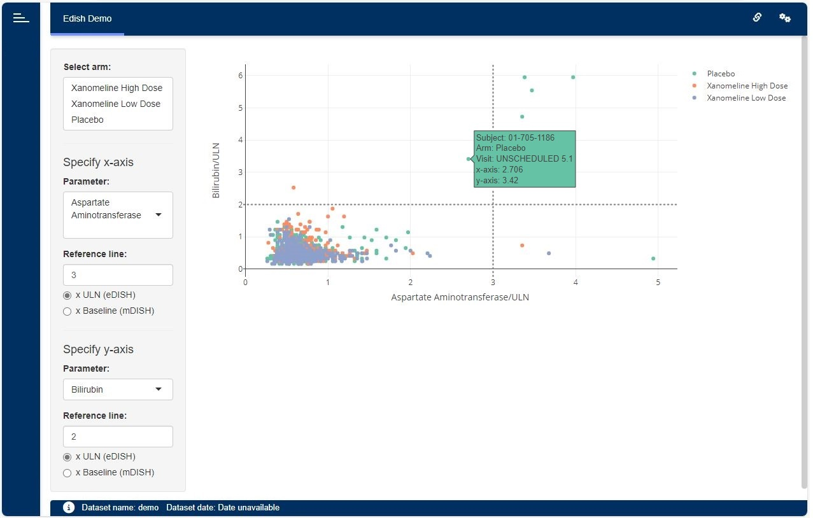

# eDISH Module

The {dv.edish} package is meant to support the assessment of drug-induced liver injury 
by means of the (modified) evaluation of Drug-Induced Serious Hepatotoxicity plot.



## Installation

``` r
if (!require("remotes")) install.packages("remotes")
remotes::install_github("Boehringer-Ingelheim/dv.edish")
```

## Features

The eDISH module shows a scatter plot depicting correlations of two lab parameters on subject-level. 
The parameter to be displayed on each axis can be selected by the app user. 
Moreover, the parameters can be displayed in multiples of either their upper limit normals 
(resulting in the eDISH plot) or the corresponding subject's baseline values (resulting in the mDISH plot). 
Horizontal and vertical lines are indicating Hy's law and are customizable as well within the input menu.


## Creating an eDISH application

The following example shows how to set up a simple DaVinci app by means of {dv.manager}. 
The app contains the eDISH module to display dummy data provided by the {pharmaverseadam} package: 


``` r
dm <- pharmaverseadam::adsl
lb <- pharmaverseadam::adlb
  
module_list <- list(
  "edish" = dv.edish::mod_edish(
    module_id = "edish",
    dataset_names = c("dm", "lb"),
    arm_default_vals = c("Xanomeline Low Dose", "Xanomeline High Dose"),
    baseline_visit_val = "SCREENING 1"
  )
)

dv.manager::run_app(
  data = list("demo" = list("dm" = dm, "lb" = lb)),
  module_list = module_list,
  filter_data = "dm"
)
```

Note that the module expects two datasets: 

- A Demographics dataset (e.g. `dm` or `adsl`) including, at least, variables containing the following information:

  - Unique subject identifier (e.g. `USUBJID`)
  
  - Arm (e.g. `ACTARM`)
  
- A Laboratory Test Results dataset (e.g. `lb` or `adlb`) including, at least, variables containing the following information:

  - Unique subject identifier (e.g. `USUBJID`)
  
  - Visit (e.g. `VISIT`)
  
  - Lab test result name (e.g. `LBTEST`)
  
  - Numeric lab test result (e.g. `LBSTRESN`)
  
  - Lab test reference range upper limit (e.g. `LBSTNRHI`)
  

