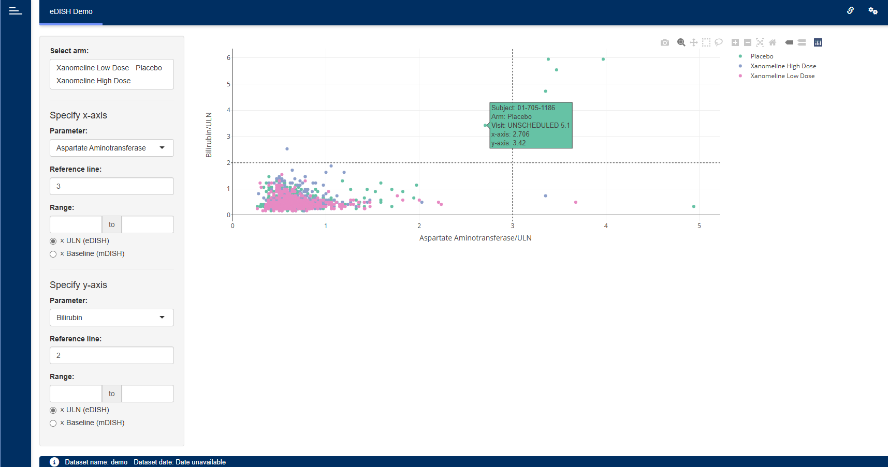

# eDISH Module

The eDISH module supports the assessment of drug-induced liver injury by
means of the (modified) evaluation of Drug-Induced Serious
Hepatotoxicity plot.



## Installation

``` r

if (!require("remotes")) install.packages("remotes")
remotes::install_github("Boehringer-Ingelheim/dv.edish")
```

## Features

The eDISH module shows a scatter plot depicting the correlation between
peak values of an aminotransferase parameter and a liver function
parameter on a subject level.

The user can control the following from the user interface drop-down
plot options:

- Treatment arm selection.
- The aminotransferase parameter to be displayed on the x-axis
  (e.g. Alanine Aminotransferase or Aspartate Aminotransferase).
- The liver function parameter to be displayed on the y-axis (e.g. Total
  Bilirubin or Prothrombin Intl. Normalized Ratio)
- The window in which the liver function parameter value is considered
  in relation to the aminotransferase value.
- Whether the parameters are displayed in multiples of either their
  upper limits of normal (resulting in the eDISH plot) or the
  corresponding subject’s baseline values (resulting in the mDISH plot).
- Horizontal and vertical reference lines indicating Hy’s law multiples.
- Whether to include subjects based on their baseline value being within
  the aminotransferase threshold.
- Whether to plot subject aminotransferase values by visit, with lines
  connecting points between visits.
- Lower and/or upper values of the x- and y-axis ranges. If not
  specified then these values are determined by the data.

When hovering over a point the following pop-up information is
displayed:

- Subject identifier.
- Arm.
- Normalized aminotransferase peak value, visit, and date.
- Associated normalized Alkaline Phosphatase value categorized.
- R-ratio categorized.
- Normalized liver function parameter peak value, visit, and date.
- Time in days between aminotransferase and liver function dates.
  Negative days indicates that liver function date is before
  aminotransferase date.

Normalized Alkaline Phosphatase (ALP/ULN or ALP/Baseline) categories are
shown as ≤ 2 or \> 2.

The R-ratio (specific to ULN) is calculated as
`R = Normalized aminotransferase / Normalized ALP`:

- R ≥ 5 Hepatocellular - aminotransferase dominates; typical for Hy’s
  Law
- R ≤ 2 Cholestatic - ALP dominates
- 2 \< R \< 5 Mixed - Both aminotransferase and ALP elevated

## Creating an eDISH application

The following example shows how to set up a simple DaVinci app by means
of {dv.manager}. The app contains the eDISH module to display dummy data
provided by the {pharmaverseadam} package:

``` r

dm <- pharmaverseadam::adsl
lb <- pharmaverseadam::adlb
  
module_list <- list(
  "edish" = dv.edish::mod_edish(
    module_id = "edish",
    subject_level_dataset_name = "dm",
    lab_dataset_name = "lb",
    lb_date_var = "ADT",
    arm_default_vals = c("Xanomeline Low Dose", "Xanomeline High Dose"),
    baseline_visit_val = "SCREENING 1"
  )
)

dv.manager::run_app(
  data = list("demo" = list("dm" = dm, "lb" = lb)),
  module_list = module_list,
  filter_data = "dm"
)
```

Note that the module expects two datasets:

- A Demographics dataset (e.g. `dm` or `adsl`) including, at least,
  variables containing the following information:

  - Unique subject identifier (e.g. `USUBJID`)

  - Arm (e.g. `ACTARM`)

- A Laboratory Test Results dataset (e.g. `lb` or `adlb`) including, at
  least, variables containing the following information:

  - Unique subject identifier (e.g. `USUBJID`)

  - Visit (e.g. `VISIT`)

  - Lab test result name (e.g. `LBTEST`)

  - Lab test date (e.g. `ADT`)

  - Numeric lab test result (e.g. `LBSTRESN`)

  - Lab test reference range upper limit (e.g. `LBSTNRHI`)
